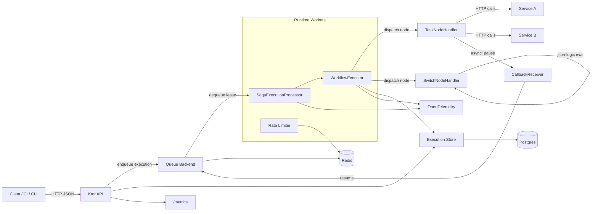

# Trama Saga Orchestrator

Lightweight saga orchestration for distributed workflows, built with Kotlin + Ktor.

## Why Trama
Trama helps you coordinate multi-step operations across services with retries, compensation, and persistent execution tracking.

## Features
- HTTP API to register, version, and run saga definitions.
- Inline or stored-definition execution modes.
- **v2 node-graph definitions** — branching (`switch`), async tasks, arbitrary node DAGs.
- **Switch nodes** — JSON Logic expressions route execution to different branches at runtime.
- **Async HTTP tasks** — send a request, pause the saga, resume when an external system calls back via signed token.
- Retry policies (`retry` and `backoff`) with compensation flows.
- Redis-backed runtime queue and optional Redis-backed execution store.
- Redis standalone and Redis Cluster support with virtual-shard distribution and rendezvous-based pod ownership.
- Postgres persistence for definitions, execution status, and step results.
- OpenTelemetry tracing and Prometheus metrics.
- Automatic Postgres partition maintenance and retention cleanup.

## OpenAPI
- Full API contract: [`openapi.json`](./openapi.json)

You can import `openapi.json` into Swagger UI, Postman, Insomnia, or codegen tooling.

## Architecture


## Getting Started

### Prerequisites
- JDK 21
- Postgres
- Redis

### Run with Docker
```bash
docker compose up --build
```

API base URL: `http://localhost:8080`

### Run locally
```bash
./gradlew run
```

## Configuration
Defaults are in `src/main/resources/application.yaml`.

Configuration is loaded from `application.yaml`, then merged with environment variables and JVM system properties. The code also keeps explicit compatibility overrides for `RUNTIME_ENABLED`, `METRICS_ENABLED`, `TELEMETRY_ENABLED`, `REDIS_URL`, `DATABASE_HOST`, `DATABASE_PORT`, `DATABASE_DATABASE`, `DATABASE_USER`, and `DATABASE_PASSWORD`.

### Redis
| Key | Type | Default | Description |
|---|---|---:|---|
| `redis.topology` | enum | `STANDALONE` | Redis backend mode: `STANDALONE` or `CLUSTER`. |
| `redis.url` | string | `redis://localhost:6379` | Primary Redis URI. Also used as the fallback seed node in cluster mode when `redis.cluster.nodes` is empty. |
| `redis.cluster.nodes` | list<string> | `[]` | Seed node list for Redis Cluster discovery. |
| `redis.pool.maxTotal` | int | `16` | Max pooled standalone Redis connections. |
| `redis.pool.maxIdle` | int | `16` | Max idle standalone Redis connections. |
| `redis.pool.minIdle` | int | `0` | Min idle standalone Redis connections. |
| `redis.pool.testOnBorrow` | boolean | `true` | Validates pooled standalone connections when borrowed. |
| `redis.pool.testWhileIdle` | boolean | `true` | Validates pooled standalone connections while idle. |
| `redis.queue.keyPrefix` | string | `saga:executions` | Prefix for ready and in-flight queue keys. |
| `redis.consumer.batchSize` | int | `50` | Max executions claimed per polling cycle. |
| `redis.consumer.processingTimeoutMillis` | long | `60000` | Lease timeout before in-flight work becomes eligible for requeue. |
| `redis.consumer.requeueIntervalMillis` | long | `5000` | Interval for expired in-flight requeue scans. |
| `redis.sharding.virtualShardCount` | int | `1024` | Number of virtual shards used to spread Redis queue and execution-store keys. |
| `redis.sharding.podId` | string | `$HOSTNAME` or `unknown-pod` | Local runtime identity used for shard ownership. |
| `redis.sharding.membershipKey` | string | `saga:runtime:pods` | ZSET key that tracks live runtime pods. |
| `redis.sharding.membershipTtlMillis` | long | `10000` | TTL window for pod liveness before ownership is considered stale. |
| `redis.sharding.heartbeatIntervalMillis` | long | `3000` | How often each pod refreshes its membership entry. |
| `redis.sharding.refreshIntervalMillis` | long | `2000` | How often each pod reloads membership and recalculates ownership. |
| `redis.sharding.claimerCount` | int | `min(runtime.workerCount, 4)` | Number of shard-claiming coroutines. When unset, the runtime derives a safe default. |

### Database
| Key | Type | Default | Description |
|---|---|---:|---|
| `database.host` | string | `db` | Postgres host. |
| `database.port` | int | `5432` | Postgres port. |
| `database.database` | string | `saga` | Postgres database name. |
| `database.user` | string | `saga` | Postgres user. |
| `database.password` | string | `saga` | Postgres password. |
| `database.pool.maxPoolSize` | int | `10` | Max JDBC pool size. |
| `database.pool.minIdle` | int | `1` | Min idle JDBC connections. |

### Runtime and HTTP
| Key | Type | Default | Description |
|---|---|---:|---|
| `runtime.enabled` | boolean | `true` | Enables runtime workers, Redis consumption, retry scheduling, and background jobs. |
| `runtime.workerCount` | int | `4` | Number of worker coroutines that execute saga steps. |
| `runtime.bufferSize` | int | `200` | Internal processor channel buffer size. |
| `runtime.emptyPollDelayMillis` | long | `50` | Delay between empty queue polls. |
| `runtime.maxStepsPerExecution` | int | `25` | Checkpoint limit per worker cycle before an execution is re-enqueued. |
| `runtime.store` | enum | `REDIS` | Execution state backend: `REDIS` or `POSTGRES`. |
| `runtime.callback.baseUrl` | string | `""` | Public base URL this runtime is reachable at — used to build callback URLs injected into async task requests. Required for async tasks. |
| `runtime.callback.hmacSecret` | string | `""` | HMAC-SHA256 secret for signing and validating callback tokens. Required for async tasks. |
| `runtime.callback.hmacKid` | string | `default` | Key ID embedded in the token for future key rotation. |
| `http.connectTimeoutMillis` | long | `10000` | Outbound HTTP client connect timeout for saga steps. |
| `http.requestTimeoutMillis` | long | `30000` | Total outbound HTTP request timeout for saga steps. |
| `http.socketTimeoutMillis` | long | `30000` | Outbound HTTP socket timeout for saga steps. |

### Maintenance
| Key | Type | Default | Description |
|---|---|---:|---|
| `maintenance.enabled` | boolean | `true` | Enables partition creation and retention cleanup jobs. |
| `maintenance.partitionLookaheadMonths` | int | `13` | Number of future monthly partitions to pre-create. |
| `maintenance.partitionStartOffsetMonths` | int | `1` | Starting month offset used when generating partitions. |
| `maintenance.retentionDays` | int | `15` | Retention period for execution data cleanup. |
| `maintenance.intervalMillis` | long | `3600000` | Interval between maintenance runs. |

### Rate limiting
| Key | Type | Default | Description |
|---|---|---:|---|
| `rateLimit.enabled` | boolean | `true` | Enables saga-level failure-rate throttling. |
| `rateLimit.maxFailures` | long | `5` | Failure threshold within the observation window. |
| `rateLimit.windowMillis` | long | `60000` | Failure observation window. |
| `rateLimit.blockMillis` | long | `60000` | How long a saga is blocked after crossing the threshold. |
| `rateLimit.keyPrefix` | string | `saga:rate` | Prefix for rate-limit keys. |

### Observability
| Key | Type | Default | Description |
|---|---|---:|---|
| `metrics.enabled` | boolean | `true` | Enables Micrometer collection and the `GET /metrics` endpoint. |
| `telemetry.enabled` | boolean | `false` | Enables OpenTelemetry initialization. |
| `telemetry.serviceName` | string | `trama` | OpenTelemetry service name. |
| `telemetry.otlpEndpoint` | string | `http://localhost:4317` | OTLP collector endpoint. |

### Redis Cluster example
```yaml
redis:
  topology: "CLUSTER"
  cluster:
    nodes:
      - "redis://redis-cluster-0:6379"
      - "redis://redis-cluster-1:6379"
      - "redis://redis-cluster-2:6379"
  queue:
    keyPrefix: "saga:executions"
  sharding:
    virtualShardCount: 1024
    membershipKey: "saga:runtime:pods"
    membershipTtlMillis: 10000
    heartbeatIntervalMillis: 3000
    refreshIntervalMillis: 2000
```

In cluster mode, Trama places each execution on a deterministic virtual shard, stores related queue keys with the same Redis hash tag, and lets every runtime pod compute shard ownership locally using rendezvous hashing over the shared membership ZSET. That keeps multi-key queue scripts slot-safe while allowing pods to rebalance without leader election.

## API Overview

### Endpoints
| Method | Path | Description |
|---|---|---|
| `GET` | `/healthz` | Liveness check. |
| `GET` | `/readyz` | Readiness check. |
| `POST` | `/sagas/definitions` | Store saga definition (v1 or v2). |
| `GET` | `/sagas/definitions` | List stored definitions. |
| `GET` | `/sagas/definitions/{id}` | Get definition by UUID. |
| `PUT` | `/sagas/definitions/{id}` | Insert definition with explicit UUID. |
| `DELETE` | `/sagas/definitions/{id}` | Delete definition by UUID. |
| `POST` | `/sagas/definitions/{name}/{version}/run` | Run stored definition. |
| `POST` | `/sagas/run` | Run inline definition (v1 or v2). |
| `GET` | `/sagas/{id}` | Get execution status. |
| `POST` | `/sagas/{id}/retry` | Retry failed execution. |
| `POST` | `/sagas/{id}/node/{nodeId}/callback` | Async callback delivery endpoint. |
| `GET` | `/metrics` | Prometheus metrics (if enabled). |

### Definition formats

Trama supports two definition formats, auto-detected by the presence of `nodes`.

#### v1 — linear steps (backward-compatible)
| Field | Type | Required | Description |
|---|---|---|---|
| `name` | string | Yes | Definition name. |
| `version` | string | Yes | Definition version. |
| `failureHandling` | object | Yes | Retry/backoff strategy. |
| `steps` | array | Yes | Ordered saga steps with `up` and `down` calls. |
| `onSuccessCallback` | `HttpCall` | No | Called after successful completion. |
| `onFailureCallback` | `HttpCall` | No | Called after compensation/failure. |

#### v2 — node graph (branching + async)
| Field | Type | Required | Description |
|---|---|---|---|
| `name` | string | Yes | Definition name. |
| `version` | string | Yes | Definition version. |
| `failureHandling` | object | Yes | Retry/backoff strategy. |
| `entrypoint` | string | Yes | ID of the first node to execute. |
| `nodes` | array | Yes | List of `task` or `switch` node definitions. |
| `onSuccessCallback` | `HttpCall` | No | Called after successful completion. |
| `onFailureCallback` | `HttpCall` | No | Called after compensation/failure. |

##### `task` node
| Field | Type | Required | Description |
|---|---|---|---|
| `kind` | `"task"` | Yes | Node discriminator. |
| `id` | string | Yes | Unique node ID within the definition. |
| `action` | object | Yes | The HTTP action to perform. |
| `action.mode` | `"sync"` \| `"async"` | Yes | Synchronous or async callback mode. |
| `action.request` | `HttpCall` | Yes | The outbound HTTP request. |
| `action.successStatusCodes` | `Set<Int>` | No | Override default success codes. |
| `action.acceptedStatusCodes` | `Set<Int>` | No | Status codes that mean "accepted for async" (e.g. `[202]`). |
| `action.callback` | object | Only for `async` | Async callback configuration. |
| `action.callback.timeoutMillis` | long | Yes (async) | How long to wait for callback before failing. |
| `action.callback.successWhen` | JSON Logic | No | Expression evaluated against callback body to confirm success. |
| `action.callback.failureWhen` | JSON Logic | No | Expression evaluated against callback body to trigger failure. |
| `compensation` | `HttpCall` | No | Called during rollback. |
| `next` | string | No | Next node ID. Omit for terminal nodes. |

##### `switch` node
| Field | Type | Required | Description |
|---|---|---|---|
| `kind` | `"switch"` | Yes | Node discriminator. |
| `id` | string | Yes | Unique node ID. |
| `cases` | array | Yes | Ordered list of conditional branches. |
| `cases[].name` | string | No | Human-readable case label. |
| `cases[].when` | JSON Logic | Yes | Expression evaluated against `input.*` and `nodes.*` context. |
| `cases[].target` | string | Yes | Node ID to route to when this case matches. |
| `default` | string | Yes | Node ID to route to when no case matches. |

Switch expressions can reference:
- `input.<key>` — execution payload fields
- `nodes.<nodeId>.response.body.<field>` — response body of a previously completed node

### `failureHandling` variants
| Type | Fields |
|---|---|
| `retry` | `maxAttempts`, `delayMillis` |
| `backoff` | `maxAttempts`, `initialDelayMillis`, `maxDelayMillis`, `multiplier`, `jitterRatio` |

### Async callback token

When an `async` task node fires its outbound request, the orchestrator injects two template variables:

| Template variable | Description |
|---|---|
| `{{runtime.callback.url}}` | The full callback URL for this execution and node. |
| `{{runtime.callback.token}}` | Signed HMAC token that must be sent as the `X-Callback-Token` header. |

The external service must POST to the callback URL with `X-Callback-Token: <token>` to resume the saga.

Callback responses:
| Status | Meaning |
|---|---|
| `202` | Callback accepted, saga will resume. |
| `400` | Malformed token. |
| `401` | Invalid signature. |
| `409` | Nonce replayed or attempt mismatch. |
| `410` | Token expired or execution no longer waiting. |

## Usage Examples

### v1 — Linear steps

#### 1) Create a v1 definition
```bash
curl -X POST http://localhost:8080/sagas/definitions \
  -H 'Content-Type: application/json' \
  -d '{
    "name": "order-saga",
    "version": "v1",
    "failureHandling": {
      "type": "retry",
      "maxAttempts": 3,
      "delayMillis": 500
    },
    "steps": [
      {
        "name": "reserve",
        "up": {
          "url": "http://inventory/reserve",
          "verb": "POST",
          "body": { "orderId": "{{payload.orderId}}" }
        },
        "down": {
          "url": "http://inventory/release",
          "verb": "POST",
          "body": { "orderId": "{{payload.orderId}}" }
        }
      }
    ]
  }'
```

#### 2) Run stored definition
```bash
curl -X POST http://localhost:8080/sagas/definitions/order-saga/v1/run \
  -H 'Content-Type: application/json' \
  -d '{ "payload": { "orderId": "ord-123", "amount": 99.5 } }'
```

#### 3) Check status
```bash
curl http://localhost:8080/sagas/<execution-id>
```

#### 4) Retry failed execution
```bash
curl -X POST http://localhost:8080/sagas/<execution-id>/retry
```

---

### v2 — Node graph with switch branching

Run an inline checkout saga that routes to a different payment node based on `paymentMethod`:

```bash
curl -X POST http://localhost:8080/sagas/run \
  -H 'Content-Type: application/json' \
  -d '{
    "definition": {
      "name": "checkout-v2",
      "version": "v1",
      "failureHandling": { "type": "retry", "maxAttempts": 2, "delayMillis": 100 },
      "entrypoint": "choose-payment",
      "nodes": [
        {
          "kind": "switch",
          "id": "choose-payment",
          "cases": [
            {
              "name": "pix",
              "when": { "==": [{ "var": "input.paymentMethod" }, "pix"] },
              "target": "pix-payment"
            },
            {
              "name": "card",
              "when": { "==": [{ "var": "input.paymentMethod" }, "card"] },
              "target": "card-payment"
            }
          ],
          "default": "fallback-payment"
        },
        {
          "kind": "task",
          "id": "pix-payment",
          "action": {
            "mode": "sync",
            "request": {
              "url": "http://payments/pix",
              "verb": "POST",
              "body": { "orderId": "{{payload.orderId}}" }
            }
          },
          "compensation": { "url": "http://payments/pix/cancel", "verb": "POST" }
        },
        {
          "kind": "task",
          "id": "card-payment",
          "action": {
            "mode": "sync",
            "request": {
              "url": "http://payments/card",
              "verb": "POST",
              "body": { "orderId": "{{payload.orderId}}" }
            }
          },
          "compensation": { "url": "http://payments/card/cancel", "verb": "POST" }
        },
        {
          "kind": "task",
          "id": "fallback-payment",
          "action": {
            "mode": "sync",
            "request": {
              "url": "http://payments/fallback",
              "verb": "POST"
            }
          }
        }
      ]
    },
    "payload": { "orderId": "ord-456", "paymentMethod": "pix" }
  }'
```

---

### v2 — Async task with callback

An `authorize` node sends a request and pauses. The external service calls back using the injected token to resume the saga:

```bash
curl -X POST http://localhost:8080/sagas/run \
  -H 'Content-Type: application/json' \
  -d '{
    "definition": {
      "name": "payment-async",
      "version": "v1",
      "failureHandling": { "type": "retry", "maxAttempts": 2, "delayMillis": 200 },
      "entrypoint": "authorize",
      "nodes": [
        {
          "kind": "task",
          "id": "authorize",
          "action": {
            "mode": "async",
            "request": {
              "url": "http://payments/authorize",
              "verb": "POST",
              "body": {
                "orderId": "{{payload.orderId}}",
                "callbackUrl": "{{runtime.callback.url}}",
                "callbackToken": "{{runtime.callback.token}}"
              }
            },
            "acceptedStatusCodes": [202],
            "callback": { "timeoutMillis": 30000 }
          },
          "compensation": { "url": "http://payments/authorize/cancel", "verb": "POST" },
          "next": "capture"
        },
        {
          "kind": "task",
          "id": "capture",
          "action": {
            "mode": "sync",
            "request": {
              "url": "http://payments/capture",
              "verb": "POST"
            }
          }
        }
      ]
    },
    "payload": { "orderId": "ord-789", "amount": 150.00 }
  }'
```

The external payment service receives `callbackUrl` and `callbackToken` in the request body, then calls back:

```bash
curl -X POST http://localhost:8080/sagas/<executionId>/node/authorize/callback \
  -H 'Content-Type: application/json' \
  -H 'X-Callback-Token: <token>' \
  -d '{ "status": "authorized", "authCode": "AUTH-001" }'
```

## Development

### Run tests
```bash
./gradlew test
```

### Demo scripts

#### v1 linear saga demo
```bash
cd scripts/saga_demo
pip install -r requirements.txt
python flask_server.py &         # start mock service on :5001
python run_saga.py --scenario success
python run_saga.py --scenario fail_up
```

#### v2 switch branching demo
```bash
cd scripts/workflow_demo
pip install -r requirements.txt
python flask_server.py &         # start mock service on :5002
python run_switch_demo.py        # runs pix, card, boleto (default) scenarios
python run_switch_demo.py --scenario pix
```

#### v2 async callback demo

Async callbacks require the orchestrator to be configured with a reachable `callbackBaseUrl`:

```yaml
# application.yaml
runtime:
  callback:
    baseUrl: "http://localhost:8080"   # must be reachable by the mock service
    hmacSecret: "dev-secret-change-me"
```

```bash
cd scripts/workflow_demo
pip install -r requirements.txt
SAGA_DEMO_ASYNC_DELAY=2 python flask_server.py &   # mock service fires callback after 2s
python run_async_demo.py
```

### Project layout
| Path | Purpose |
|---|---|
| `src/main/kotlin/run/trama/app` | Ktor API module. |
| `src/main/kotlin/run/trama/runtime` | Runtime bootstrap and workers. |
| `src/main/kotlin/run/trama/saga` | Saga models and execution engine. |
| `src/main/kotlin/run/trama/saga/workflow` | v2 IR, `WorkflowExecutor`, node handlers, JSON Logic evaluator. |
| `src/main/kotlin/run/trama/saga/callback` | Async callback token service and receiver. |
| `src/main/kotlin/run/trama/saga/redis` | Redis queue/store/rate-limit components. |
| `src/main/kotlin/run/trama/saga/store` | Postgres persistence. |
| `src/main/resources/application.yaml` | Default runtime configuration. |
| `openapi.json` | OpenAPI contract for clients/tooling. |
| `scripts/saga_demo/` | Demo scripts for v1 linear sagas. |
| `scripts/workflow_demo/` | Demo scripts for v2 switch branching and async callbacks. |

## Observability

### Prometheus metrics
Metrics are exposed at `GET /metrics` when `metrics.enabled=true`.

| Metric | Type | Description |
|---|---|---|
| `saga_enqueue_total` | Counter | Number of saga executions pushed to the backend queue. |
| `saga_dequeue_total` | Counter | Number of saga executions claimed from the backend queue. |
| `saga_processed_total` | Counter | Number of executions processed by workers (successful or not). |
| `saga_failed_total` | Counter | Number of executions that ended in non-success outcome in a worker cycle. |
| `saga_retried_total` | Counter | Number of executions scheduled for retry. |
| `saga_rate_limited_total` | Counter | Number of executions delayed by rate limiting. |
| `saga_redis_claim_scans_total` | Counter | Number of Redis shard claim scan attempts performed by consumers. |
| `saga_inmemory_queue_size` | Gauge | Current size of the in-memory write buffer used before queue persistence. |
| `saga_redis_active_pods` | Gauge | Current number of live runtime pods seen in Redis membership. |
| `saga_redis_owned_shards` | Gauge | Number of virtual shards currently owned by this pod. |
| `saga_redis_membership_refresh_age_ms` | Gauge | Age of the last successful membership refresh on this pod. |
| `saga_duration_seconds` | Histogram | End-to-end saga duration recorded on terminal status (`SUCCEEDED`, `FAILED`, `CORRUPTED`). |
| `saga_step_duration_success_seconds` | Histogram | Per-step duration recorded only when a step call succeeds. |
| `saga_callback_received_total` | Counter | Async callbacks delivered to the orchestrator. |
| `saga_callback_rejected_total` | Counter | Async callbacks rejected (expired, bad signature, replay, mismatch). |
| `saga_callback_timeout_total` | Counter | Async tasks that timed out waiting for a callback. |
| `saga_switch_evaluations_total` | Counter | Switch node evaluations. |
| `saga_node_duration_seconds` | Histogram | Per-node execution duration. |

Notes:
- The names above are Prometheus-normalized versions of Micrometer meters defined in code.
- You will also see framework-level metrics (for example HTTP server metrics) from Micrometer/Ktor when enabled.

### Metric labels
| Metric | Labels |
|---|---|
| `saga_enqueue_total` | `saga_name`, `saga_version`, `phase` |
| `saga_dequeue_total` | `saga_name`, `saga_version`, `phase` |
| `saga_processed_total` | `saga_name`, `saga_version`, `phase`, `outcome` |
| `saga_failed_total` | `saga_name`, `saga_version`, `phase`, `reason` |
| `saga_retried_total` | `saga_name`, `saga_version`, `phase` |
| `saga_rate_limited_total` | `saga_name`, `saga_version`, `phase` |
| `saga_redis_claim_scans_total` | none |
| `saga_duration_seconds` | `saga_name`, `saga_version`, `final_status` |
| `saga_step_duration_success_seconds` | `saga_name`, `saga_version`, `step_name` |
| `saga_callback_received_total` | `saga_name`, `saga_version` |
| `saga_callback_rejected_total` | `saga_name`, `saga_version`, `reason` |
| `saga_callback_timeout_total` | `saga_name`, `saga_version` |
| `saga_switch_evaluations_total` | `saga_name`, `saga_version`, `result` (`case`\|`default`) |
| `saga_node_duration_seconds` | `saga_name`, `saga_version`, `node_kind` (`task`\|`switch`), `mode` (`sync`\|`async`) |

### Tracing
OpenTelemetry spans are emitted for request handling and saga processing when `telemetry.enabled=true`.

### Operational notes
- `GET /healthz` is a simple liveness check.
- `GET /readyz` validates Redis connectivity and, when the runtime is enabled, also verifies Redis membership freshness for shard ownership.
- Additional observability references are available in [`GRAFANA_DASHBOARD_OBSERVABILITY.md`](./GRAFANA_DASHBOARD_OBSERVABILITY.md) and [`REDIS_CLUSTER_SHARDING.md`](./REDIS_CLUSTER_SHARDING.md).

## License
Licensed under the Apache License, Version 2.0. See [LICENSE](./LICENSE).
