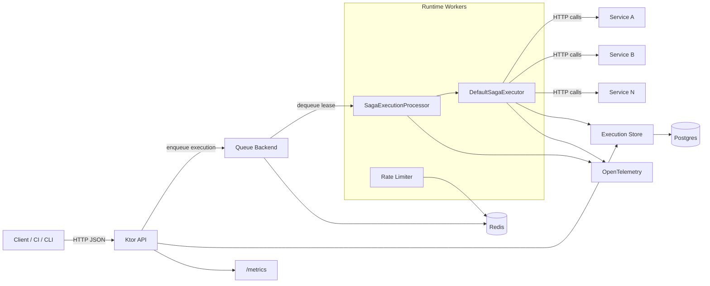

# Trama Saga Orchestrator

Lightweight saga orchestration for distributed workflows, built with Kotlin + Ktor.

## Why Trama
Trama helps you coordinate multi-step operations across services with retries, compensation, and persistent execution tracking.

## Features
- HTTP API to register, version, and run saga definitions.
- Inline or stored-definition execution modes.
- Retry policies (`retry` and `backoff`) with compensation flows.
- Redis-backed runtime queue and optional Redis-backed execution store.
- Postgres persistence for definitions, execution status, and step results.
- OpenTelemetry tracing and Prometheus metrics.

## OpenAPI
- Full API contract: [`openapi.json`](./openapi.json)

You can import `openapi.json` into Swagger UI, Postman, Insomnia, or codegen tooling.

## Architecture


## Getting Started

### Prerequisites
- JDK 21
- Postgres
- Redis

### Run with Docker
```bash
docker compose up --build
```

API base URL: `http://localhost:8080`

### Run locally
```bash
./gradlew run
```

## Configuration
Defaults are in `src/main/resources/application.yaml`.

### Core parameters
| Key | Type | Default | Description |
|---|---|---:|---|
| `runtime.enabled` | boolean | `true` | Enables worker runtime and queue processing. |
| `runtime.workerCount` | int | `4` | Number of concurrent worker coroutines. |
| `runtime.bufferSize` | int | `200` | Internal channel buffer for runtime processing. |
| `runtime.emptyPollDelayMillis` | long | `50` | Delay between empty queue polls. |
| `runtime.maxStepsPerExecution` | int | `25` | Checkpoint limit per worker cycle before re-enqueue. |
| `runtime.store` | enum | `REDIS` | Execution store backend (`REDIS` or `POSTGRES`). |
| `redis.url` | string | `redis://localhost:6379` | Redis connection URL. |
| `redis.consumer.batchSize` | int | `50` | Max queue items fetched per poll. |
| `redis.consumer.processingTimeoutMillis` | long | `60000` | In-flight timeout before requeue. |
| `database.host` | string | `db` | Postgres host. |
| `database.port` | int | `5432` | Postgres port. |
| `database.database` | string | `saga` | Postgres database name. |
| `database.user` | string | `saga` | Postgres user. |
| `rateLimit.enabled` | boolean | `true` | Enables saga-level rate limiting. |
| `rateLimit.maxFailures` | long | `5` | Failures within window before blocking. |
| `rateLimit.windowMillis` | long | `60000` | Failure observation window. |
| `rateLimit.blockMillis` | long | `60000` | Block time when threshold is exceeded. |
| `metrics.enabled` | boolean | `true` | Enables `/metrics` endpoint and Micrometer collection. |
| `telemetry.enabled` | boolean | `false` | Enables OpenTelemetry pipeline. |

### Environment overrides
`RUNTIME_ENABLED`, `METRICS_ENABLED`, `TELEMETRY_ENABLED`, `REDIS_URL`, `DATABASE_HOST`, `DATABASE_PORT`, `DATABASE_DATABASE`, `DATABASE_USER`, `DATABASE_PASSWORD`

## API Overview

### Endpoints
| Method | Path | Description |
|---|---|---|
| `GET` | `/healthz` | Liveness check. |
| `GET` | `/readyz` | Readiness check. |
| `POST` | `/sagas/definitions` | Store saga definition. |
| `GET` | `/sagas/definitions` | List stored definitions. |
| `GET` | `/sagas/definitions/{id}` | Get definition by UUID. |
| `PUT` | `/sagas/definitions/{id}` | Insert definition with explicit UUID. |
| `DELETE` | `/sagas/definitions/{id}` | Delete definition by UUID. |
| `POST` | `/sagas/definitions/{name}/{version}/run` | Run stored definition. |
| `POST` | `/sagas/run` | Run inline definition. |
| `GET` | `/sagas/{id}` | Get execution status. |
| `POST` | `/sagas/{id}/retry` | Retry failed execution. |
| `GET` | `/metrics` | Prometheus metrics (if enabled). |

### Definition schema quick reference
| Field | Type | Required | Description |
|---|---|---|---|
| `name` | string | Yes | Definition name. |
| `version` | string | Yes | Definition version. |
| `failureHandling` | object | Yes | Retry/backoff strategy. |
| `steps` | array | Yes | Ordered saga steps with `up` and `down` calls. |
| `onSuccessCallback` | `HttpCall` | No | Callback after successful completion. |
| `onFailureCallback` | `HttpCall` | No | Callback after compensation/failure flow. |

### `failureHandling` variants
| Type | Fields |
|---|---|
| `retry` | `maxAttempts`, `delayMillis` |
| `backoff` | `maxAttempts`, `initialDelayMillis`, `maxDelayMillis`, `multiplier`, `jitterRatio` |

## Usage Examples

### 1) Create a definition
```bash
curl -X POST http://localhost:8080/sagas/definitions \
  -H 'Content-Type: application/json' \
  -d '{
    "name": "order-saga",
    "version": "v1",
    "failureHandling": {
      "type": "retry",
      "maxAttempts": 3,
      "delayMillis": 500
    },
    "steps": [
      {
        "name": "reserve",
        "up": {
          "url": { "value": "http://inventory/reserve" },
          "verb": "POST",
          "body": { "value": "{\"orderId\":\"{{payload.orderId}}\"}" }
        },
        "down": {
          "url": { "value": "http://inventory/release" },
          "verb": "POST",
          "body": { "value": "{\"orderId\":\"{{payload.orderId}}\"}" }
        }
      }
    ]
  }'
```

### 2) Run stored definition
```bash
curl -X POST http://localhost:8080/sagas/definitions/order-saga/v1/run \
  -H 'Content-Type: application/json' \
  -d '{
    "payload": {
      "orderId": "ord-123",
      "amount": 99.5
    }
  }'
```

### 3) Check status
```bash
curl http://localhost:8080/sagas/<execution-id>
```

### 4) Retry failed execution
```bash
curl -X POST http://localhost:8080/sagas/<execution-id>/retry
```

## Development

### Run tests
```bash
./gradlew test
```

### Project layout
| Path | Purpose |
|---|---|
| `src/main/kotlin/io/trama/app` | Ktor API module. |
| `src/main/kotlin/io/trama/runtime` | Runtime bootstrap and workers. |
| `src/main/kotlin/io/trama/saga` | Saga models and execution engine. |
| `src/main/kotlin/io/trama/saga/redis` | Redis queue/store/rate-limit components. |
| `src/main/kotlin/io/trama/saga/store` | Postgres persistence. |
| `src/main/resources/application.yaml` | Default runtime configuration. |
| `openapi.json` | OpenAPI contract for clients/tooling. |

## Observability

### Prometheus metrics
Metrics are exposed at `GET /metrics` when `metrics.enabled=true`.

| Metric | Type | Description |
|---|---|---|
| `saga_enqueue_total` | Counter | Number of saga executions pushed to the backend queue. |
| `saga_dequeue_total` | Counter | Number of saga executions claimed from the backend queue. |
| `saga_processed_total` | Counter | Number of executions processed by workers (successful or not). |
| `saga_failed_total` | Counter | Number of executions that ended in non-success outcome in a worker cycle. |
| `saga_retried_total` | Counter | Number of executions scheduled for retry. |
| `saga_rate_limited_total` | Counter | Number of executions delayed by rate limiting. |
| `saga_inmemory_queue_size` | Gauge | Current size of the in-memory write buffer used before queue persistence. |
| `saga_duration_seconds` | Histogram | End-to-end saga duration recorded on terminal status (`SUCCEEDED`, `FAILED`, `CORRUPTED`). |
| `saga_step_duration_success_seconds` | Histogram | Per-step duration recorded only when a step call succeeds. |

Notes:
- The names above are Prometheus-normalized versions of Micrometer meters defined in code.
- You will also see framework-level metrics (for example HTTP server metrics) from Micrometer/Ktor when enabled.

### Metric labels
| Metric | Labels |
|---|---|
| `saga_enqueue_total` | `saga_name`, `saga_version`, `phase` |
| `saga_dequeue_total` | `saga_name`, `saga_version`, `phase` |
| `saga_processed_total` | `saga_name`, `saga_version`, `phase`, `outcome` |
| `saga_failed_total` | `saga_name`, `saga_version`, `phase`, `reason` |
| `saga_retried_total` | `saga_name`, `saga_version`, `phase` |
| `saga_rate_limited_total` | `saga_name`, `saga_version`, `phase` |
| `saga_duration_seconds` | `saga_name`, `saga_version`, `final_status` |
| `saga_step_duration_success_seconds` | `saga_name`, `saga_version`, `step_name` |

### Tracing
OpenTelemetry spans are emitted for request handling and saga processing when `telemetry.enabled=true`.

## License
Licensed under the Apache License, Version 2.0. See [LICENSE](./LICENSE).
