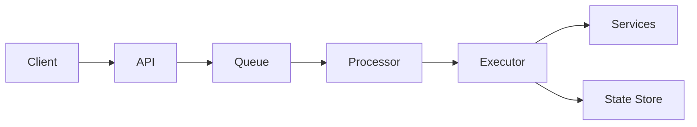

# Trama

> Stop building orchestration logic inside your services.

Trama is a lightweight way to orchestrate distributed workflows using HTTP — without heavy infrastructure, complex runtimes, or vendor lock-in.

---

## The problem

Every backend eventually ends up doing this:

- retries scattered across services  
- async callbacks with no control  
- cron jobs polling databases  
- state machines hidden in application code  

It works — until it doesn’t.

---

## The solution

Define your workflow as JSON. Trama handles execution, retries, async callbacks, and state.

---

## Example

A payment flow with async authorization and sync capture:

```json
{
  "name": "payment-flow",
  "version": "v1",
  "entrypoint": "authorize",
  "nodes": [
    {
      "kind": "task",
      "id": "authorize",
      "action": {
        "mode": "async",
        "request": {
          "url": "http://payments/authorize",
          "verb": "POST",
          "body": {
            "orderId": "{{payload.orderId}}",
            "callbackUrl": "{{runtime.callback.url}}",
            "callbackToken": "{{runtime.callback.token}}"
          }
        },
        "acceptedStatusCodes": [202],
        "callback": {
          "timeoutMillis": 30000
        }
      },
      "next": "capture"
    },
    {
      "kind": "task",
      "id": "capture",
      "action": {
        "mode": "sync",
        "request": {
          "url": "http://payments/capture",
          "verb": "POST"
        }
      }
    }
  ]
}
```

👉 No polling. No cron. No manual state tracking.

---

## Why not just use queues?

Queues are great — but they don’t solve orchestration:

- no execution state tracking  
- no branching logic  
- no async coordination  
- no retry semantics across steps  

You end up rebuilding orchestration logic in every service.

---

## Why not Temporal?

Temporal is powerful — but often too heavy for most teams.

Trama focuses on:

- minimal setup  
- HTTP-first integration  
- simple mental model  
- fast adoption  

---

## Quick start

```bash
docker compose up --build
```

API: http://localhost:8080

---

## When NOT to use Trama

Trama is not for every case.

Avoid it if:

- you need long-running workflows (days or weeks)  
- you need full event sourcing  
- you already run Temporal/Cadence successfully  

---

## Core capabilities

- JSON-defined workflows (v1 linear, v2 node graph)
- branching with JSON Logic (`switch` nodes)
- async HTTP tasks with callback resumption
- retries and compensation strategies
- Redis-backed execution queue
- Postgres persistence
- OpenTelemetry tracing
- Prometheus metrics

---

## Architecture (simplified)



---

## Usage

### Run a workflow

```bash
curl -X POST http://localhost:8080/sagas/run \
  -H 'Content-Type: application/json' \
  -d '{
    "definition": { ... },
    "payload": { ... }
  }'
```

### Check status

```bash
curl http://localhost:8080/sagas/<execution-id>
```

---

## Definition formats

- linear flows
- branching (`switch`)
- async tasks
- DAG-style execution

---

## Async callbacks

Async tasks pause execution and resume via callback.

Trama injects:

- `callbackUrl`
- `callbackToken` (HMAC signed)

The external service must call back using:

```
X-Callback-Token: <token>
```

---

## Observability

- Prometheus metrics at `/metrics`
- OpenTelemetry tracing
- Execution-level visibility

---

## Development

```bash
./gradlew run
```

---

## License

Apache License 2.0
