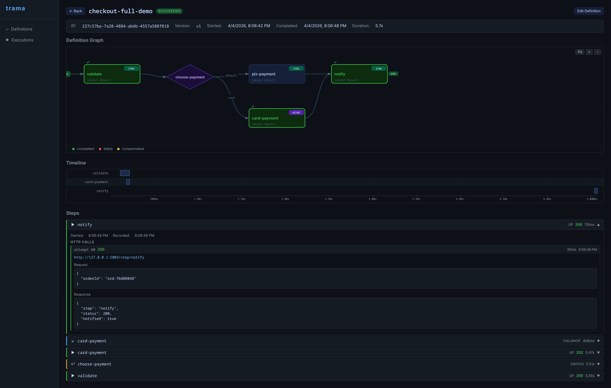
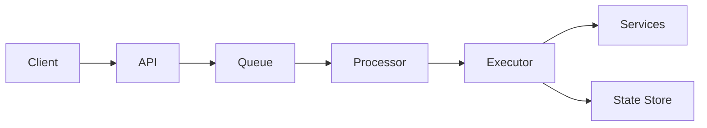

# Trama

> Stop building orchestration logic inside your services.

Trama is a lightweight way to orchestrate distributed workflows using HTTP — without heavy infrastructure, complex runtimes, or vendor lock-in.

---

## The problem

Most systems don’t lack orchestration — they implement it implicitly.

Teams start with event-driven choreography:

- Service A emits an event  
- Service B reacts and emits another event  
- Service C continues the flow  

At first, it works.

As complexity grows, teams start adding:

- retries inside each service  
- ad-hoc logic to handle async flows  
- cron jobs to recover inconsistencies  

Over time, this becomes an **implicit workflow engine**:

- no single place to understand the flow  
- no clear execution state  
- hard to debug and reason about  
- difficult to evolve safely  

---

## The solution

Make orchestration explicit.

Define your workflow as JSON. Trama handles execution, retries, async callbacks, and state.

---

## Example

A payment flow with async authorization and sync capture:

```json
{
  "name": "payment-flow",
  "version": "v1",
  "entrypoint": "authorize",
  "nodes": [
    {
      "kind": "task",
      "id": "authorize",
      "action": {
        "mode": "async",
        "request": {
          "url": "http://payments/authorize",
          "verb": "POST",
          "body": {
            "orderId": "{{payload.orderId}}",
            "callbackUrl": "{{runtime.callback.url}}",
            "callbackToken": "{{runtime.callback.token}}"
          }
        },
        "acceptedStatusCodes": [202],
        "callback": {
          "timeoutMillis": 30000
        }
      },
      "next": "capture"
    },
    {
      "kind": "task",
      "id": "capture",
      "action": {
        "mode": "sync",
        "request": {
          "url": "http://payments/capture",
          "verb": "POST"
        }
      }
    }
  ]
}
```

👉 No polling. No cron. No hidden state machines.

---

## Why not just use events and queues?

Event-driven systems are great — but choreography has limits.

As flows become complex, you end up with:

- implicit execution order  
- duplicated retry logic  
- inconsistent recovery strategies  
- no global visibility of the workflow  

You already built an orchestrator — just not an explicit one.

---

## Why not Temporal?

Temporal is powerful — but often too heavy for most teams.

It introduces:

- new programming model  
- dedicated infrastructure  
- operational complexity  

Trama focuses on a different tradeoff:

- minimal setup  
- HTTP-first integration  
- simple mental model  
- fast adoption  

---

## Quick start

```bash
docker compose up --build
```

API: http://localhost:8080

---

## When NOT to use Trama

Trama is not for every case.

Avoid it if:

- you need full event sourcing
- you already run Temporal/Cadence successfully  

---

## Core capabilities

- JSON-defined workflows (v1 linear, v2 node graph)
- branching with JSON Logic (`switch` nodes)
- async HTTP tasks with callback resumption
- time-based pauses (`sleep` nodes) with early-wake via API
- retries and compensation strategies
- Redis-backed execution queue
- Postgres persistence
- OpenTelemetry tracing
- Prometheus metrics
- visual management UI

---

## Management UI

Trama ships a built-in web interface for managing and debugging workflows.



**Key features:**

- **Definitions** — list, create, edit, and delete saga definitions with a visual graph editor
- **Executions** — search and inspect executions by ID
- **Execution inspector**:
  - Definition graph with per-step status overlay (success / failed / compensated)
  - Gantt timeline showing step latency and compensation phases
  - Per-step request / response detail with HTTP status and duration
  - Retry failed executions from the UI

The UI is served by a lightweight Python BFF (`ui/bff/`) and available at `http://localhost:9000` when running via Docker Compose.

---

## Architecture (simplified)



---

## Usage

### Run a workflow

```bash
curl -X POST http://localhost:8080/sagas/run \
  -H 'Content-Type: application/json' \
  -d '{
    "definition": { ... },
    "payload": { ... }
  }'
```

### Check status

```bash
curl http://localhost:8080/sagas/<execution-id>
```

---

## Definition formats

Trama supports two formats:

### Linear steps
Simple sequential workflows with compensation.

### Node graph
Supports:

- branching (`switch`)
- async tasks
- time-based pauses (`sleep`)
- DAG-style execution

---

## Async callbacks

Async tasks pause execution and resume via callback.

Trama injects:

- `callbackUrl`
- `callbackToken` (HMAC signed)

The external service must call back using:

```
X-Callback-Token: <token>
```

---

## Observability

- Prometheus metrics at `/metrics`
- OpenTelemetry tracing
- Execution-level visibility

---

## Development

```bash
./gradlew run
```

---

## CLI tools

### validate

Validates a saga definition offline — no running server needed. Takes two phases:

1. **Structural check** — parses the JSON, verifies node IDs are unique, all `next`/`target` references resolve to existing nodes, switch nodes have a `default`, async nodes have a positive `timeoutMillis`, and all required fields are present.
2. **Execution simulation** *(optional)* — walks the node graph using mock responses, renders Mustache templates, evaluates JSON Logic conditions, and prints the full execution trace. Catches bugs that structural checks miss (wrong variable names in templates, switch conditions that never match, etc.).

```
./gradlew trama-validate --args="<definition.json> [scenario.json] [--validate-only]"
```

| Argument | Required | Description |
|---|---|---|
| `definition.json` | yes | v2 saga definition (must contain `nodes`) |
| `scenario.json` | no | mock responses per node; enables simulation |
| `--validate-only` | no | skip simulation even if a scenario is provided |

**Structural check only:**

```
$ ./gradlew trama-validate --args="definition.json --validate-only"

━━━━━━━━━━━━━━━━━━━━━━━━━━━━━━━━━━━━━━━━━━━━━━━━━━━━━━━━━━
  trama validate  ·  checkout-full-demo / v1
━━━━━━━━━━━━━━━━━━━━━━━━━━━━━━━━━━━━━━━━━━━━━━━━━━━━━━━━━━

[1/1] Structural validation
  ✓ 5 nodes  (3 task, 1 switch, 1 async)
  ✓ all node references resolve

OK
```

**Full dry-run with scenario:**

```json
// scenario.json
{
  "payload": {
    "orderId": "ord-demo-001",
    "amount":  "99.90",
    "paymentMethod": "pix"
  },
  "steps": {
    "validate":    { "status": 200, "body": { "valid": true } },
    "pix-payment": { "status": 200, "body": { "charged": true, "method": "pix" } },
    "notify":      { "status": 200, "body": { "notified": true } }
  }
}
```

Only nodes that actually execute need entries in `steps`; unreached branches are ignored.

```
$ ./gradlew trama-validate --args="definition.json scenario.json"

━━━━━━━━━━━━━━━━━━━━━━━━━━━━━━━━━━━━━━━━━━━━━━━━━━━━━━━━━━
  trama validate  ·  checkout-full-demo / v1
━━━━━━━━━━━━━━━━━━━━━━━━━━━━━━━━━━━━━━━━━━━━━━━━━━━━━━━━━━

[1/2] Structural validation
  ✓ 5 nodes  (3 task, 1 switch, 1 async)
  ✓ all node references resolve

[2/2] Execution simulation
  payload: {orderId=ord-demo-001, amount=99.90, paymentMethod=pix}

  → validate             [sync]
      POST    http://localhost:5003/step/validate
      body    {"orderId":"ord-demo-001","amount":"99.90"}
      ← 200   ✓  {"valid":true}

  → choose-payment       [switch]
      matched "pix"  →  pix-payment

  → pix-payment          [sync]
      POST    http://localhost:5003/step/pix-payment
      body    {"orderId":"ord-demo-001","method":"pix"}
      ← 200   ✓  {"charged":true,"method":"pix"}

  → notify               [sync]
      POST    http://localhost:5003/step/notify
      body    {"orderId":"ord-demo-001"}
      ← 200   ✓  {"notified":true}

  ✓ SUCCEEDED

All checks passed.
```

For async nodes the simulator renders the outbound request, marks it as `[async]`, injects a placeholder callback body, and pauses — mirroring production behaviour:

```
  → card-payment         [async]
      POST    http://localhost:5003/async-step/card-payment
      body    {"orderId":"ord-demo-002","method":"card","callbackUrl":"...","callbackToken":"..."}
      ← 202   accepted (execution pauses here in production)
      callback ← {"status":"approved","authCode":"AUTH-9871"}
```

**Exit codes:** `0` = all checks passed · `1` = validation or simulation failed

---

## License

Apache License 2.0
