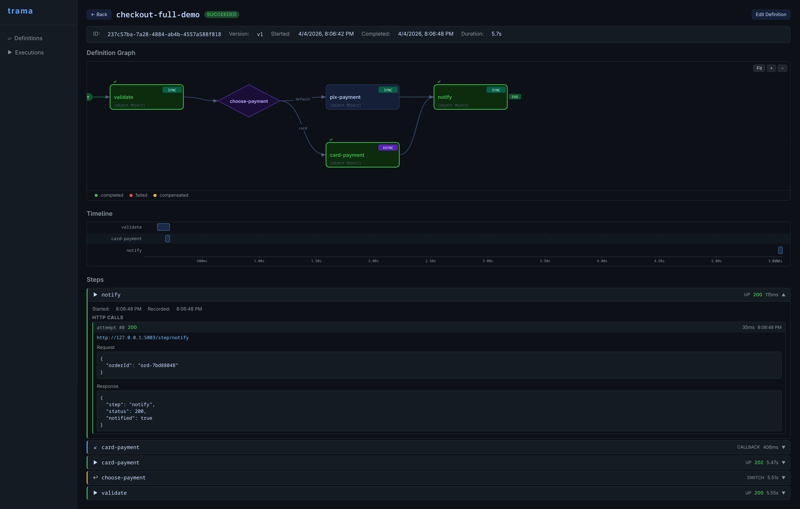
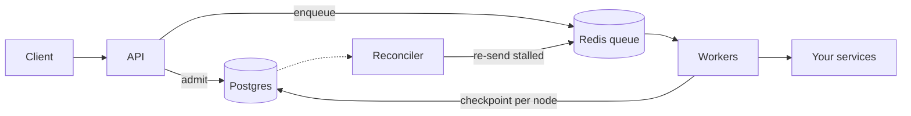

# Trama

> Stop building orchestration logic inside your services.

Trama is a lightweight way to orchestrate distributed workflows using HTTP — without heavy infrastructure, complex runtimes, or vendor lock-in.

---

## The problem

Most systems don’t lack orchestration — they implement it implicitly.

Teams start with event-driven choreography:

- Service A emits an event  
- Service B reacts and emits another event  
- Service C continues the flow  

At first, it works.

As complexity grows, teams start adding:

- retries inside each service  
- ad-hoc logic to handle async flows  
- cron jobs to recover inconsistencies  

Over time, this becomes an **implicit workflow engine**:

- no single place to understand the flow  
- no clear execution state  
- hard to debug and reason about  
- difficult to evolve safely  

---

## The solution

Make orchestration explicit.

Define your workflow as JSON. Trama handles execution, retries, async callbacks, and state.

---

## Example

A payment flow: an async authorization, voided if anything later fails, then a sync capture.

```json
{
  "name": "payment-flow",
  "version": "v1",
  "failureHandling": { "type": "retry", "maxAttempts": 3, "delayMillis": 1000 },
  "entrypoint": "authorize",
  "nodes": [
    {
      "kind": "task",
      "id": "authorize",
      "action": {
        "mode": "async",
        "request": {
          "url": "http://payments/authorize",
          "verb": "POST",
          "headers": { "Idempotency-Key": "{{sagaId}}-authorize" },
          "body": {
            "orderId": "{{payload.orderId}}",
            "callbackUrl": "{{runtime.callback.url}}",
            "callbackToken": "{{runtime.callback.token}}"
          }
        },
        "acceptedStatusCodes": [202],
        "callback": { "timeoutMillis": 30000 }
      },
      "compensation": {
        "url": "http://payments/authorizations/{{payload.orderId}}",
        "verb": "DELETE"
      },
      "next": "capture"
    },
    {
      "kind": "task",
      "id": "capture",
      "action": {
        "mode": "sync",
        "request": {
          "url": "http://payments/capture",
          "verb": "POST",
          "headers": { "Idempotency-Key": "{{sagaId}}-capture" },
          "body": { "orderId": "{{payload.orderId}}" }
        }
      }
    }
  ]
}
```

👉 No polling. No cron. No hidden state machines.

- **Retries:** if `capture` fails, it is retried up to 3 times.
- **Compensation:** if it still fails, Trama runs the compensations of the nodes that completed
  (here it voids the authorization), and the execution ends `FAILED`.
- **Async callback:** the authorization service answers `202` and calls back later. If no
  callback arrives within 30 s, the node fails.

### Templates

Requests are [Mustache](https://mustache.github.io/) templates. Available values:

| Value | Meaning |
|---|---|
| `{{payload.x}}` (or `{{input.x}}`) | The run's payload |
| `{{nodes.<id>.response.body.x}}` | The response body of a completed node |
| `{{prev.body.x}}` | The previous node's response body |
| `{{sagaId}}`, `{{sagaName}}`, `{{sagaVersion}}` | The execution |
| `{{runtime.callback.url}}`, `{{runtime.callback.token}}` | Async nodes only: where and how to call back |

`{{ }}` escapes the value for where it lands:
- inside JSON string literals for JSON bodies (by `Content-Type`, or a body starting with `{`/`[` when none is set);
- XML entities for XML/HTML bodies;
- form encoding for `application/x-www-form-urlencoded`;
- the literal value in URLs, headers (line breaks removed) and other bodies.

`{{{ }}}` always inserts the raw value.

---

## Why not just use events and queues?

Event-driven systems are great — but choreography has limits.

As flows become complex, you end up with:

- implicit execution order  
- duplicated retry logic  
- inconsistent recovery strategies  
- no global visibility of the workflow  

You already built an orchestrator — just not an explicit one.

---

## Why not Temporal?

Temporal is powerful — but often too heavy for most teams.

It introduces:

- new programming model  
- dedicated infrastructure  
- operational complexity  

Trama focuses on a different tradeoff:

- minimal setup  
- HTTP-first integration  
- simple mental model  
- fast adoption  

---

## Quick start

```bash
docker compose up --build
```

- API: http://localhost:9080 (`/readyz` answers `ready` once it can take work)
- Management UI: http://localhost:9000
- Postgres on `:5432`, Redis on `:6379`

`scripts/` has runnable demos: mock downstream services plus scripts that drive workflows against them.

---

## When NOT to use Trama

Trama is not for every case.

Avoid it if:

- you need full event sourcing
- you already run Temporal/Cadence successfully  

---

## Core capabilities

- JSON-defined workflows: v1 linear steps, or a v2 node graph
- **Branching:** `switch` nodes with JSON Logic
- **Parallel branches:** `split` / `join`
- **Async HTTP tasks** resumed by a signed callback, with a deadline
- **Pauses:** `sleep` nodes, with early wake via the API
- **Failures:** retries (fixed or exponential backoff) and compensation
- **Hooks:** `onSuccessCallback` / `onFailureCallback`
- **Durability:** every execution is checkpointed in Postgres at each node, and recovered after
  crashes or Redis data loss
- **Horizontal scaling:** workers share a sharded Redis queue, with no coordinator
- **Offline validator and dry-run** (`trama-validate`)
- **Operations:** Prometheus metrics, OpenTelemetry tracing, Grafana dashboard
- **Visual management UI**

---

## Management UI

Trama ships a built-in web interface for managing and debugging workflows.



**Key features:**

- **Definitions** — list, create, edit, and delete saga definitions with a visual graph editor
- **Executions** — search and inspect executions by ID
- **Execution inspector**:
  - Definition graph with per-step status overlay (success / failed / compensated)
  - Gantt timeline showing step latency and compensation phases
  - Per-step request / response detail with HTTP status and duration
  - Retry failed executions from the UI

The UI is served by a lightweight Python BFF (`ui/bff/`) and available at `http://localhost:9000` when running via Docker Compose.

---

## Architecture (simplified)


```mermaid
flowchart LR
  C[Client] --> A[API]
  A -- admit --> PG[(Postgres)]
  A -- enqueue --> Q[(Redis queue)]
  Q --> W[Workers]
  W --> S[Your services]
  W -- checkpoint per node --> PG
  R[Reconciler] -- re-send stalled --> Q
  PG -.-> R
```

- **Postgres is the source of truth.** It holds definitions, each execution's state and resume
  point, step history and join barriers.
- **Redis carries the work queue.** It is split into virtual shards that pods divide among
  themselves by rendezvous hashing.
- **Workers are the same binary.** Run as many as you need; a pod can also serve only the API
  (`RUNTIME_ENABLED=false`).

---

## Usage

### Run a workflow

```bash
curl -X POST http://localhost:9080/workflows/run \
  -H 'Content-Type: application/json' \
  -d '{
    "definition": { ... },
    "payload": { "orderId": "ord-1" }
  }'
# → {"id": "<execution-id>"}
```

Or store the definition once and run it by name. Running stored definitions works for the v1
format only for now.

```bash
curl -X POST http://localhost:9080/workflows/definitions -H 'Content-Type: application/json' -d @definition.json
curl -X POST http://localhost:9080/workflows/definitions/payment-flow/v1/run -H 'Content-Type: application/json' -d '{"payload": {...}}'
```

### Check status

```bash
curl http://localhost:9080/workflows/<execution-id>          # status, failure, timestamps
curl http://localhost:9080/workflows/<execution-id>/steps    # every node result
```

### API

| Endpoint | |
|---|---|
| `POST /workflows/run` | Run an inline definition |
| `GET /workflows?status=&name=` | List executions |
| `GET /workflows/{id}` | Status |
| `GET /workflows/{id}/steps`, `/steps/calls` | Step results and the HTTP calls behind them |
| `POST /workflows/{id}/retry` | Re-run a `FAILED` execution (v1 definitions) |
| `POST /workflows/{id}/wake` | Wake a sleeping execution now |
| `POST /workflows/{id}/node/{nodeId}/callback` | Async callback (`X-Callback-Token` header) |
| `/workflows/definitions` | Create, list, get, update and delete stored definitions; run by name/version |
| `GET /healthz`, `/readyz`, `/metrics` | Probes and Prometheus metrics |

Full contract: [`openapi.json`](openapi.json).

---

## Definition formats

Trama supports two formats.

### Linear steps (v1)

A list of `steps`, each with an `up` call and an optional `down` compensation, run in order.

### Node graph (v2)

`entrypoint` plus `nodes`, each with a `kind`:

| Kind | What it does |
|---|---|
| `task` | An HTTP call: `sync`, or `async` (waits for a callback). Optional `compensation`. |
| `switch` | Picks the next node with JSON Logic `cases` and a `default` |
| `sleep` | Pauses for `durationMillis` |
| `split` | Runs `branches` in parallel, each as its own execution |
| `join` | Continues once every branch of its `split` has finished |

Both formats require `failureHandling`:
- `{"type": "retry", "maxAttempts": 3, "delayMillis": 1000}`; or
- `{"type": "backoff", "maxAttempts": 5, "initialDelayMillis": 500, "maxDelayMillis": 30000}`.

Validate a definition offline with [`trama-validate`](#cli-tools) before deploying it.

---

## Async callbacks

An `async` task sends its request, expects one of `acceptedStatusCodes` (e.g. `202`), and parks
the execution. The request should pass `{{runtime.callback.url}}` and
`{{runtime.callback.token}}` to the service, which later calls back:

```
POST <callback url>                   # /workflows/{executionId}/node/{nodeId}/callback
X-Callback-Token: <token>             # HMAC-signed, single use
Content-Type: application/json

{ ...any body... }
```

- **Outcome.** The callback succeeds unless `callback.failureWhen` matches; `callback.successWhen`
  can require a condition instead. Both are JSON Logic over `callback.body` and `payload`.
- **Timeout.** No callback before `callback.timeoutMillis` fails the node, which is then retried
  or compensated.
- **Configuration.** Callbacks need `RUNTIME_CALLBACK_BASEURL` (the public URL of the API) and
  `RUNTIME_CALLBACK_HMACSECRET`.

---

## Delivery and durability

- **At-least-once.** If a worker dies (or pauses past its claim lease) during an HTTP call, the
  call is made again by the worker that takes over. Make downstream endpoints idempotent, for
  example with a header like `Idempotency-Key: {{sagaId}}-<nodeId>`.
- **Postgres is the source of truth.** Every node boundary records the execution's checkpoint in
  Postgres, and every write is fenced: a worker holding an outdated copy cannot overwrite newer
  progress or a final status.
- **Redis holds the queue.** If Redis loses data, the reconciler re-sends executions that stopped
  advancing, from their last checkpoint (after `reconciler.staleAfterMillis`, default 2 min). AOF
  persistence (`appendfsync everysec`) keeps that delay short.
- **API-only processes.** With `RUNTIME_ENABLED=false` a process serves the API (runs, callbacks,
  queries) and leaves execution to worker processes.

---

## Configuration

Defaults live in [`app/main/resources/application.yaml`](app/main/resources/application.yaml); the most common ones can be set through the environment:

| Variable | Default | |
|---|---|---|
| `PORT` | `8080` | HTTP port |
| `DATABASE_HOST`, `DATABASE_PORT`, `DATABASE_DATABASE`, `DATABASE_USER`, `DATABASE_PASSWORD` | | Postgres (migrated on startup) |
| `REDIS_URL`, `REDIS_TOPOLOGY`, `REDIS_CLUSTER_NODES` | `redis://localhost:6379`, `STANDALONE` | Redis, standalone or cluster |
| `RUNTIME_ENABLED` | `true` | `false` = API-only pod |
| `RUNTIME_WORKERCOUNT` | `32` | Executions a pod runs at once, which also bounds its concurrent downstream calls |
| `RUNTIME_CALLBACK_BASEURL`, `RUNTIME_CALLBACK_HMACSECRET` | | Required for async tasks |
| `RECONCILER_STALEAFTERMILLIS` | `120000` | How long before a stalled execution is re-sent |
| `RATELIMIT_ENABLED` | `true` | Per-workflow breaker on worker failures |
| `METRICS_ENABLED`, `TELEMETRY_ENABLED` | `true`, `false` | Prometheus, OpenTelemetry |

---

## Observability

- **Prometheus metrics** at `/metrics`, with a ready-made Grafana dashboard in
  [`grafana/`](grafana/). Series cover:
  - throughput: `saga_processed_total`, `saga_failed_total`, `saga_retried_total`;
  - durations: `saga_duration_seconds`, `saga_node_duration_seconds`;
  - callbacks: `saga_callback_*`;
  - recovery: `saga_reconciled_total`, `saga_fenced_total`, `saga_redis_errors_total`.
- **OpenTelemetry tracing** (OTLP), one span per execution and per HTTP call.
- **Structured JSON logs.** INFO has one line per execution (`saga finished`, with status and
  duration); per-node detail is at DEBUG.
- **Health probes:**
  - `/readyz` fails fast when Redis is unreachable or the consumer stalls;
  - `/healthz` fails only after `runtime.livenessStallMillis` (2 min) without consumer progress.

---

## Development

```bash
./gradlew run                       # needs Postgres and Redis (see docker-compose.yml)
./gradlew test                      # needs Docker or Podman for Testcontainers
cd ui/management-ui && npm install && npm run dev
```

With Podman, point Testcontainers at its socket, e.g.
`DOCKER_HOST=unix:///run/user/$UID/podman/podman.sock ./gradlew test`.

[`loadtest/`](loadtest/README.md) holds the fault-injection and load harness. Results of each
release's validation are in [`docs/validation-report.md`](docs/validation-report.md).

---

## CLI tools

### validate

Validates a saga definition offline — no running server needed. Takes two phases:

1. **Structural check** — parses the JSON, verifies node IDs are unique, all `next`/`target` references resolve to existing nodes, switch nodes have a `default`, async nodes have a positive `timeoutMillis`, and all required fields are present.
2. **Execution simulation** *(optional)* — walks the node graph using mock responses, renders Mustache templates, evaluates JSON Logic conditions, and prints the full execution trace. Catches bugs that structural checks miss (wrong variable names in templates, switch conditions that never match, etc.).

```
./gradlew trama-validate --args="<definition.json> [scenario.json] [--validate-only]"
```

| Argument | Required | Description |
|---|---|---|
| `definition.json` | yes | v2 saga definition (must contain `nodes`) |
| `scenario.json` | no | mock responses per node; enables simulation |
| `--validate-only` | no | skip simulation even if a scenario is provided |

**Structural check only:**

```
$ ./gradlew trama-validate --args="definition.json --validate-only"

━━━━━━━━━━━━━━━━━━━━━━━━━━━━━━━━━━━━━━━━━━━━━━━━━━━━━━━━━━
  trama validate  ·  checkout-full-demo / v1
━━━━━━━━━━━━━━━━━━━━━━━━━━━━━━━━━━━━━━━━━━━━━━━━━━━━━━━━━━

[1/1] Structural validation
  ✓ 5 nodes  (3 task, 1 switch, 1 async)
  ✓ all node references resolve

OK
```

**Full dry-run with scenario:**

```json
// scenario.json
{
  "payload": {
    "orderId": "ord-demo-001",
    "amount":  "99.90",
    "paymentMethod": "pix"
  },
  "steps": {
    "validate":    { "status": 200, "body": { "valid": true } },
    "pix-payment": { "status": 200, "body": { "charged": true, "method": "pix" } },
    "notify":      { "status": 200, "body": { "notified": true } }
  }
}
```

Only nodes that actually execute need entries in `steps`; unreached branches are ignored.

```
$ ./gradlew trama-validate --args="definition.json scenario.json"

━━━━━━━━━━━━━━━━━━━━━━━━━━━━━━━━━━━━━━━━━━━━━━━━━━━━━━━━━━
  trama validate  ·  checkout-full-demo / v1
━━━━━━━━━━━━━━━━━━━━━━━━━━━━━━━━━━━━━━━━━━━━━━━━━━━━━━━━━━

[1/2] Structural validation
  ✓ 5 nodes  (3 task, 1 switch, 1 async)
  ✓ all node references resolve

[2/2] Execution simulation
  payload: {orderId=ord-demo-001, amount=99.90, paymentMethod=pix}

  → validate             [sync]
      POST    http://localhost:5003/step/validate
      body    {"orderId":"ord-demo-001","amount":"99.90"}
      ← 200   ✓  {"valid":true}

  → choose-payment       [switch]
      matched "pix"  →  pix-payment

  → pix-payment          [sync]
      POST    http://localhost:5003/step/pix-payment
      body    {"orderId":"ord-demo-001","method":"pix"}
      ← 200   ✓  {"charged":true,"method":"pix"}

  → notify               [sync]
      POST    http://localhost:5003/step/notify
      body    {"orderId":"ord-demo-001"}
      ← 200   ✓  {"notified":true}

  ✓ SUCCEEDED

All checks passed.
```

For async nodes the simulator renders the outbound request, marks it as `[async]`, injects a placeholder callback body, and pauses — mirroring production behaviour:

```
  → card-payment         [async]
      POST    http://localhost:5003/async-step/card-payment
      body    {"orderId":"ord-demo-002","method":"card","callbackUrl":"...","callbackToken":"..."}
      ← 202   accepted (execution pauses here in production)
      callback ← {"status":"approved","authCode":"AUTH-9871"}
```

**Exit codes:** `0` = all checks passed · `1` = validation or simulation failed

---

## License

Apache License 2.0
